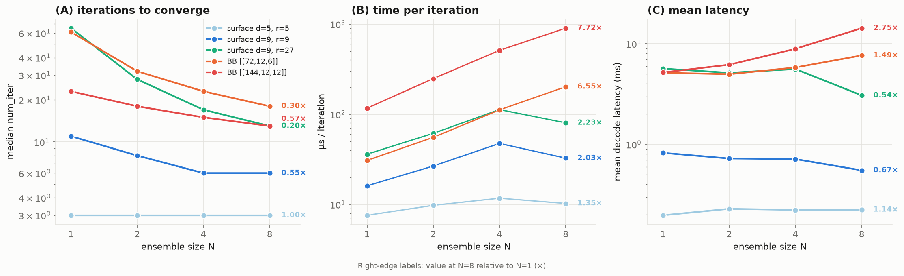
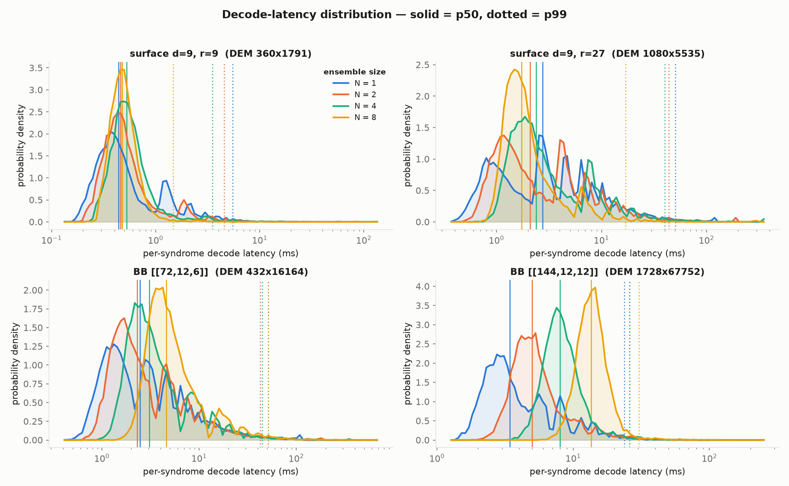
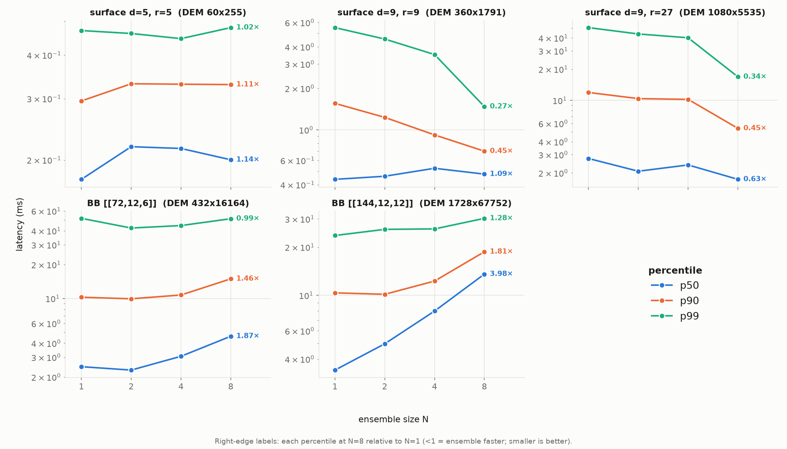
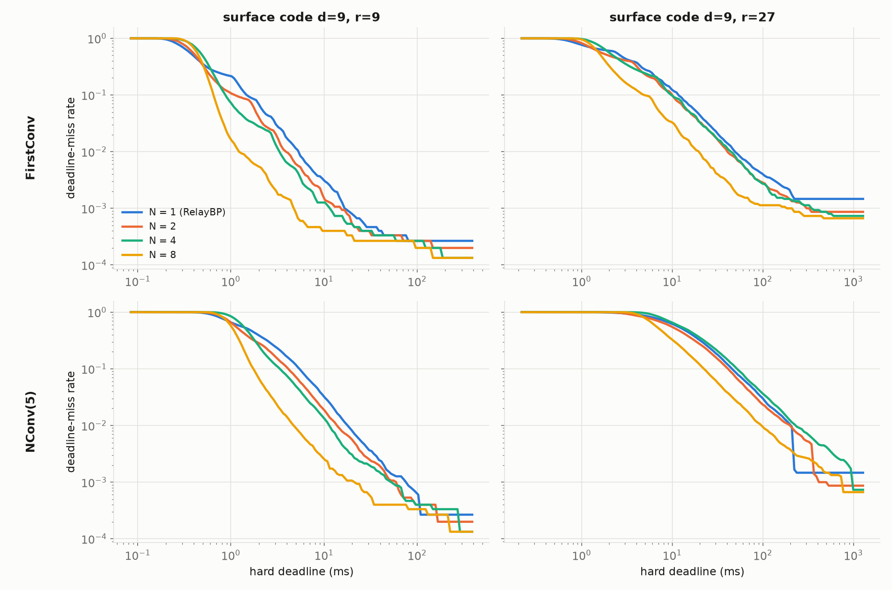
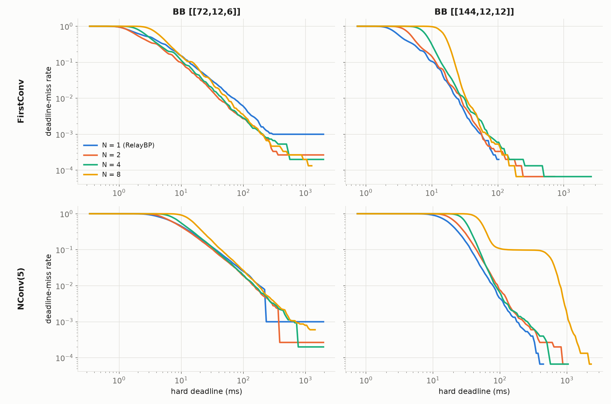

.. _ensemble_gamma_user_guide:

Gamma Ensembles for the NV-qLDPC Relay-BP Decoder
=================================================

The NV-qLDPC Relay-BP decoder supports ensembles of independent gamma distribution trajectories (N "lanes"), run in parallel on a single GPU. When any lane has satisfied the stopping criterion, then the decoder may exit early. This can lead to significantly reduced decoding times as increased parallelism allows for faster exploration of decoding solutions and therefore faster convergence.

While setting multiple lanes of ensembled gammas can reduce the number of RelayBP iterations needed to converge to a solution, it can also lead to increased time per iteration; multiple lanes share a fixed number of GPU blocks, so as the number of edges in the Tanner graph increases, the GPU eventually must serialize the execution of each lane at each iteration. We can measure these two competing effects directly; we build the circuit-level detector error model (DEM) for several codes (surface codes at distance 5 and 9, and the Tesseract bivariate-bicycle (BB) codes ``[[72,12,6]]`` and ``[[144,12,12]]``) and, for each, construct the decoder with ``gamma_ensemble_size`` set to N in {1, 2, 4, 8}. We then decode many sampled syndromes, timing each ``decode()`` call and reading back the number of RelayBP iterations the decoder used to converge:

.. code-block:: python

    import cudaq_qec as qec

    # H, error_rates, syndromes come from a circuit-level DEM of the code
    decoder = qec.get_decoder(
        "nv-qldpc-decoder", H, error_rate_vec=error_rates,
        use_sparsity=True, bp_method=3, composition=1, max_iterations=50,
        gamma0=0.3, gamma_dist=[-0.24, 0.66], clip_value=200.0, repeatable=True,
        gamma_ensemble_size=N,                       # sweep N in {1, 2, 4, 8}
        srelay_config={"pre_iter": 1, "num_sets": 64,
                       "stopping_criterion": "FirstConv"},
        opt_results={"num_iter": True})              # return the iteration count

    for syndrome in syndromes:
        result = decoder.decode(syndrome)            # timed for the per-iteration cost
        num_iter = result.opt_results["num_iter"]    # RelayBP iterations to converge

All experiments below use the same circuit-level noise and decoder settings, so they can be reproduced directly. The surface-code DEMs are built from a ``Depolarization2(p)`` channel on each two-qubit gate at ``p = 0.008``; the Tesseract bicycle-code DEMs use si1000 circuit-level noise (``r = 6`` rounds) at ``p = 0.003`` for ``[[72,12,6]]`` and ``p = 0.001`` for ``[[144,12,12]]``. The decoder is constructed as shown above, except with ``gamma0 = 0.3`` for the surface codes and ``0.125`` for the bicycle codes.

As the ensemble size N grows, the median number of iterations to converge (left) falls — more lanes explore more gamma sets in parallel, so the fastest-converging one wins sooner. But the time per iteration (middle) rises, sharply for the large bicycle-code DEMs and only mildly for the sparse surface-code DEMs. The reason is the GPU-block sharing described above: each lane's parity-check rows are spread over co-resident blocks on the GPU, so a lane with many Tanner-graph edges must serially process ``N`` times more work per iteration. The net mean decode latency (right) reflects the two effects combined: for the surface codes, it holds steady or slightly decreases, while for the BB codes, the mean latency grows. (The right-edge labels give each quantity at N = 8 relative to its N = 1 value.)

Another effect of ensembled gamma is that the latency distribution becomes narrower, leading to more consistent latency. Using the same decoders as above, we now keep the full per-syndrome decode latency rather than only its average, so that we can look at its distribution:

.. code-block:: python

    import time

    latencies = []
    for syndrome in syndromes:                       # `decoder` as constructed above
        t0 = time.perf_counter()
        decoder.decode(syndrome)
        latencies.append(1e3 * (time.perf_counter() - t0))   # per-syndrome latency, ms

Because the ensemble exits at the first lane to converge, the decode latency for a given syndrome is effectively the minimum over N independent trajectories. The minimum of N samples is statistically concentrated: as N grows, the whole distribution narrows into a tighter peak. This results in a contracted tail for the codes which do not saturate the GPU in a single lane.

For the surface-code DEMs, the worst-case (i.e. p99) latency improves by a factor of ~3×, while the median latency holds relatively steady. For the bicycle-code DEMs the percentiles rise with N, most steeply for ``[[144,12,12]]``, where the ensemble is a net latency loss at every percentile. This narrowing matters most under a hard decoding deadline; suppose each decode must finish within a wall-clock budget ``t``: if the decoder has converged by ``t`` the decode is a success, otherwise it is a failure. Sweeping the deadline ``t`` traces out the deadline-miss rate — the fraction of decodes not converged in time. The plots below show this rate versus deadline for regular RelayBP (N = 1) and for each ensemble size N; each curve is measured over 15,000 sampled syndromes per configuration at the circuit-level noise strengths given above (surface ``p = 0.008``, bicycle ``p = 0.003``/``0.001``), with ``num_sets = 128`` and ``max_iterations = 50``, and the top and bottom rows use the ``FirstConv`` and ``NConv(5)`` stopping criteria respectively.

For the surface-code DEMs the ensemble is a clear win at every deadline: because the tail latencies shrink with N, a larger ensemble converges a larger fraction of syndromes within any given budget. At an aggressive deadline the improvement is dramatic — e.g. for ``surface d=9, r=27`` under FirstConv, N = 8 misses ~3.7× fewer deadlines at a 10 ms budget (~4.7× fewer at 20 ms) than regular RelayBP, and it also reaches a lower floor because more syndromes converge at all.

For the GPU-saturated bicycle-code DEMs the picture reverses: since ensembling raises the latency here, regular RelayBP (N = 1) meets tight deadlines with the fewest failures, and larger ensembles are worse for ``[[144,12,12]]`` at every practical deadline. (For the smaller ``[[72,12,6]]`` the ensemble is slightly worse at tight deadlines but reaches a lower floor at loose ones, since more gamma sets improve the raw convergence rate.)
