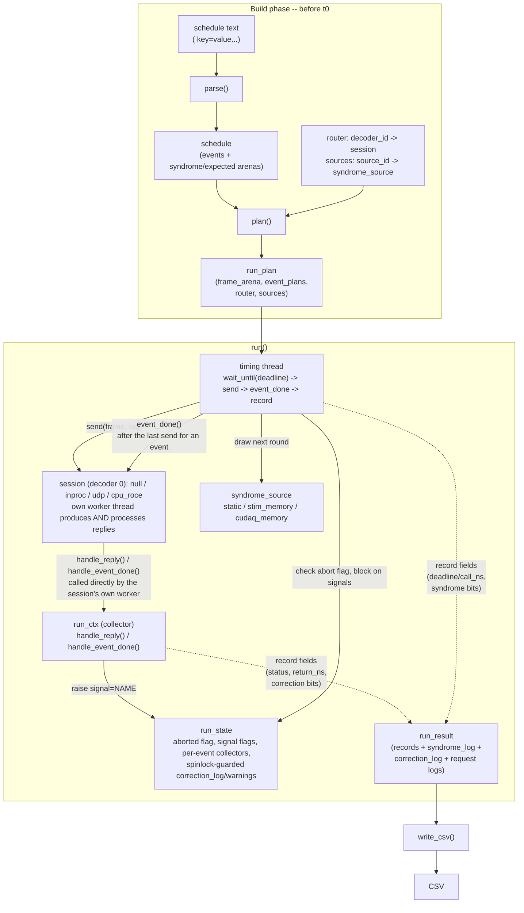

# Playback Emulator: Design Overview

## Architecture diagram

## `parse()`

Checks the syntax of the submitted schedule string: known op, well-formed
operands, monotonic trigger ticks. Purely textual -- it never touches a
decoder, a session, or a syndrome source, so it catches typos with a line
number before anything semantic is even looked at.

## `plan()`

Checks the semantics of the parsed schedule against the actual run
configuration: routes each event's `session=` to a real decoder session and
each `source=` to a real `syndrome_source`, and rejects anything that's
"statically" wrong -- an unrouted decoder id, an unregistered source id, a
frame too large for the session -- before t0, not mid-run.

## `syndrome_source`

Yields one round of syndrome bits per call, on demand, from whichever
backing data the schedule asked for:

- **`static_source`**: replays pre-supplied rounds, exactly as given. The
  reference source -- reproducible input, oracle comparisons, clean timing
  measurements.
- **`stim_memory_source`**: draws rounds just-in-time from a persistent Stim
  Pauli-frame simulator, one of Stim's built-in memory-circuit families. The
  only source that can back an open-ended `stream ... until=`, since it
  never runs out.
- **`cudaq_memory_source`**: streams a CUDA-Q `memory_circuit`'s raw
  measurements, one launch per round count under a fixed seed. Pregenerated
  per shot, so it can't back an open-ended stream the way `stim_memory_source`
  can.

## `session`

An abstraction for a transport target for RPCs, one session per decoder id.
A session carries a pre-serialized RPC frame to a decoder and reports its
reply back through `handle_reply()`/`handle_event_done()`, called directly
by the session's own worker thread -- never by blocking the caller. `udp`
and `cpu_roce` never look past the generic RPCHeader/RPCResponse framing;
`inproc` dispatches directly to a `DecodingSession` in this process and has
to interpret the frame to call the right handler; `null` interprets a frame
only far enough to size a `get_corrections` reply correctly.

### `cpu_roce`

Talks to a `decoding_server --transport=cpu_roce` over RDMA (RoCE v2 via
libibverbs) using the CUDA-Q CPU RoCE ring transceiver. Built only when the
CUDA-Q realtime install ships `libcudaq-realtime-cpu-roce-transport.a` and
libibverbs is present; otherwise the factory throws.

- **Endpoint.** Each decoder id maps to the `host:port` of that ring's TCP
  rendezvous (`port=`/`ring<id>=` on the server's `QEC_DECODING_SERVER_READY`
  line), which swaps queue-pair numbers, memory keys and RoCE IPs; the data
  plane is pure RDMA afterwards.
- **Ring geometry is a wire contract.** Requests are RDMA-written straight
  into the server's receive ring, so `num_slots` (power of two) and
  `slot_size` must equal the server's `--num-slots`/`--slot-size` (8 x 256).
  `slot_size` bounds every request *and* reply (`max_frame_bytes`, enforced
  by `plan()`). At most `num_slots` requests are in flight; further sends
  queue locally until a reply frees a slot, and their timeout starts only
  once they reach one.
- **Threads.** Between `start()` and `stop()` the transceiver's busy-polling
  RX/TX threads and one session worker run -- three cores per session,
  unlike `udp`'s single receiver blocked in `recv()`.
- **Testing.** The C++ and Python RoCE tests skip unless
  `CUDAQ_CPU_ROCE_TEST_{CHANNEL,DAEMON}_{DEVICE,IP}` are set (as for
  `test_decoding_server`); with SoftRoCE both pairs may be identical.

## `emulator`

The orchestrator and controller. It owns the timeline and splits the work
of running it across two roles:

- **Timing thread** (one, shared across every session): responsible for
  the schedule's real-time behavior -- `wait_until(deadline)`, `send()`,
  `event_done()`, and logging the dispatch side of each request. Kept to as
  little else as possible so nothing it does can perturb the timing it's
  trying to hold, with one necessary exception: JIT syndrome streaming
  (`stim_memory_source`/`cudaq_memory_source`) draws its round on this
  thread, since the round has to exist before the frame carrying it can be
  built.
- **Session worker** (one per session/decoder, owned by the session
  itself): runs the decoder (`inproc`) or talks to the wire (`udp`,
  `cpu_roce`), and
  reports each reply/event_done straight into the run() collector from that
  same thread -- there is no separate reader thread or request lookup.

## Logging

Every run accumulates its output in one `run_result`, appended to from both
the timing thread and every session's worker: the timing thread writes each
request's dispatch-side fields (`deadline_ns`/`call_ns`, syndrome bits) as
it sends; each session's worker writes that request's collected-side fields
(`status`, `return_ns`, correction bits) as replies land, through
`handle_reply()`/`handle_event_done()`. Only `correction_log` and
`warnings` are actually shared across workers (for a multi-decoder
schedule), guarded by a spinlock (`run_state::logs_lock`) held only around
that one append -- never while calling a session method, so a slow/stuck
session can't block logging on another decoder. `warn()` is the single
append point for `result.warnings` (e.g. an abort reason, or an event whose
collector never settled by the time its session stopped).

## Signals

`signal=NAME` (any op) raises a flag once that event's reply/acks are all
collected; `until=NAME` (`stream`) and `after=NAME` (any op) block on that
flag -- `until=` stops issuing further rounds once it's raised, `after=`
delays an event's own dispatch until it is. Flags live in `run_state::signals`,
one per signal name declared in the schedule, and parse-time validation
(`check_signal_order()`) rejects a schedule that references a signal no
earlier event can ever raise.

## Output (`write_csv()`)

`run_result` is one `record` per schedule line, in file order, plus the
shared syndrome/correction/request-id/timing logs each record slices into.
`write_csv()` flattens that into one CSV row per record; it's the only place
that formats output, so the CLI's `--out=` and the Python binding's
`result.write_csv()` always agree byte-for-byte.

## Entry points

The CLI (`playback_emulator_main.cpp`) and the Python binding
(`py_playback_emulator.cpp`) are both thin wrappers around the same
`parse()`/`plan()`/`run()`/`write_csv()` pipeline in `lib/`; neither adds
behavior of its own. The Python binding only exposes `run()` -- `parse()`
and `plan()` stay internal C++ plumbing there.

## Extensibility

Users should be able to script flexible, arbitrary conversations with a
decoding server -- not just the four ops that exist today -- and the tool
should extend cleanly as the decoding server's own RPC surface evolves.

## Future work

- Extend `stim_memory_source` to accept stim circuits that can be
  re-assembled, rather than only its current fixed built-in families.
- `cpu_roce`: a request that times out frees its ring slot for reuse, so a
  reply that arrives late (or a request lost on the unreliable-connected
  wire) can desynchronize the positional ring until the session is torn
  down -- the same v1 limitation CUDA-Q's `CpuRoceChannel` documents. A
  timeout aborts the run anyway, so this only matters for runs that keep
  going past one.

## Things to check

- Is the `session` abstraction leaky? `cpu_roce` fit "carry a frame, bring
  back a reply" with one addition -- `max_frame_bytes` now bounds the reply
  too -- but a GPU RoCE transport may need more.
- Keep, modify, or remove `cudaq_memory_source`?
